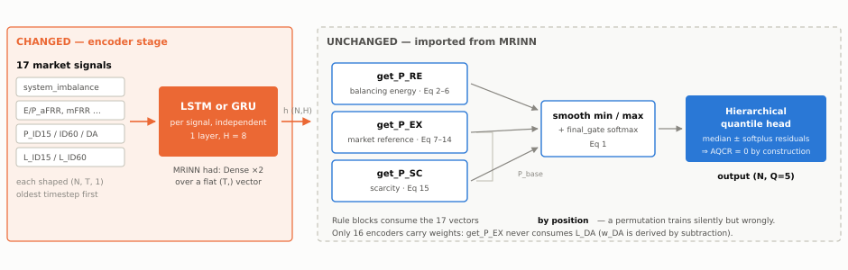

# MR-LSTM & MR-GRU: Market-Rule-Informed Recurrent Networks

**Recurrent extensions of MRINN for imbalance electricity price forecasting with a rolling 1-year training window.**

[](https://www.python.org/downloads/)
[](https://www.tensorflow.org/)
[](LICENSE)

This repository extends [MRINN](https://github.com/runyao-yu/MRINN) (Yu et al., *Advanced Engineering Informatics* 76 (2026) 105083) by replacing its per-feature Dense encoders with per-feature **LSTM** and **GRU** encoders. The market-rule head — balancing-energy (`P_RE`), market-reference (`P_EX`), scarcity (`P_SC`) price rules, smooth min/max, and the hierarchical quantile head — is **imported unchanged** from the MRINN checkout, making this a clean encoder-only ablation.



---

## Table of Contents

- [Key Contributions](#key-contributions)
- [Architecture](#architecture)
- [Results](#results)
  - [One-Step Comparison (15 min ahead)](#one-step-comparison-15-min-ahead)
  - [Input-Length Sweep](#input-length-sweep-the-main-finding)
  - [Day-Ahead Multi-Horizon (Rolling 1-Year Window)](#day-ahead-multi-horizon-rolling-1-year-window)
  - [MRINN vs MR-LSTM vs MR-GRU Comparison](#mrinn-vs-mr-lstm-vs-mr-gru-comparison)
- [Dataset](#dataset)
- [Setup](#setup)
- [Usage](#usage)
- [Repository Layout](#repository-layout)
- [Rolling 1-Year Window](#rolling-1-year-window)
- [Training Protocol](#training-protocol)
- [Caveats](#caveats)
- [Citation](#citation)
- [License](#license)

---

## Key Contributions

1. **Recurrent encoder ablation.** Replace MRINN's Dense encoder with LSTM/GRU while keeping the market-rule head unchanged. Parameter count is **constant in input length T** (4,615 for MR-GRU, 5,511 for MR-LSTM) while MRINN's grows linearly (1,799 → 13,959 across T=1…96).

2. **Multi-horizon day-ahead architecture.** A single model predicts all 96 quarter-hourly intervals of the next 24 hours in one forward pass, using a learned **HorizonEmbedding** and a fold/unfold trick to share the rule head across horizons.

3. **Rolling 1-year training window.** Drops the 2022 energy-crisis regime (mean 235 €/MWh vs 73–97 for 2023–25) and retrains quarterly. Beats both expanding-window and static training on every seed.

4. **Day-ahead outage robustness.** `DAOutageDropout` handles the real-world `P_DA_nemo` feed failure (from 2025-10-28) with zero extra parameters.

5. **Stability analysis.** MRINN's unbounded Dense encoder diverges under the expanding protocol (AQL 49.06, predictions reaching ±50,000 €/MWh). MR-GRU's tanh-bounded states prevent this entirely — one mechanism, two consequences.

---

## Architecture

### One-Step Model

```
per signal f:
    x_f (N, T, 1) ──LSTM/GRU(H)──> h_f (N, H)
                                     │
        UNCHANGED MRINN rule head ───┴──> get_P_RE / get_P_EX / get_P_SC
                                          ──> smooth_min/max + final_gate
                                          ──> HierarchicalQuantileHeadQ50 ──> (N, Q)
```

### Day-Ahead Multi-Horizon Model

```
per signal f:
  x_f (N,T,1) --LSTM/GRU(H)--> h_f (N,H) --RepeatVector(96)--> (N,96,H)
                                                                   |
  HorizonEmbedding(96,4) --tile--> (N,96,4) -----------------------+
                                                                   v
              concat -> SHARED Dense(H, swish) -> (N,96,H)   [horizon-aware]
                                                                   |
      fold (N*96, H) --> UNCHANGED MRINN rule head --> HierarchicalQuantileHeadQ50
                                                   --> unfold (N, 96, 5)
```

---

## Results

### One-Step Comparison (15 min ahead)

Austrian balancing market, 15-min resolution. **AQCR = 0 everywhere** (structurally impossible quantile crossing from the hierarchical head).

| Model | AQL ↓ | MAE ↓ | RMSE ↓ | Params |
|---|---|---|---|---|
| Naive (persistence) | 14.244 | 34.89 | 64.99 | 0 |
| MRINN (T=1) | 12.335 ± 0.113 | 33.15 | 57.11 | 1,799 |
| MRINN (T=8) | 12.472 ± 0.186 | 33.71 | 59.83 | 2,695 |
| **MR-LSTM (T=8)** | **12.190 ± 0.168** | 33.01 | 56.88 | 5,511 |
| **MR-GRU (T=8)** | 12.241 ± 0.262 | 33.48 | **56.72** | 4,615 |

### Input-Length Sweep — The Main Finding

| T | MRINN AQL | MR-LSTM AQL | MR-GRU AQL | MRINN Params | MR-GRU Params |
|---|---|---|---|---|---|
| 1 | 12.26 | 12.27 | 12.22 | 1,799 | 4,615 |
| 4 | **12.18** | 12.48 | 12.35 | 2,183 | 4,615 |
| 8 | 12.31 | 12.22 | 12.20 | 2,695 | 4,615 |
| 16 | 12.51 | 12.18 | 12.03 | 3,719 | 4,615 |
| 32 | 12.80 | 12.16 | 11.99 | 5,767 | 4,615 |
| **64** | 12.98 | **12.13** | **11.97** | 9,863 | **4,615** |
| 96 | 13.05 | 12.16 | 12.02 | 13,959 | 4,615 |

> **MRINN degrades monotonically** from T=4, while its parameter count grows 7.8×.
> MR-GRU and MR-LSTM are **flat-to-improving** at a **constant parameter count**.
> This is architectural, not statistical: a recurrent encoder's parameters are independent of sequence length.

### Day-Ahead Multi-Horizon (Rolling 1-Year Window)

Test = all of 2025 (34,521 rows). Baseline = seasonal naive (MAE 96.41). **Rolling + DA-dropout is the best configuration.**

| Model | Regime | DA-Dropout | AQL ↓ | MAE ↓ | vs Naive | Params |
|---|---|---|---|---|---|---|
| **MR-GRU** | **rolling** | **0.2** | **25.755** | **64.83** | **−32.8%** | 5,055 |
| MR-GRU | rolling | 0.0 | 26.113 | 67.50 | −30.0% | 5,055 |
| MRINN | rolling | 0.0 | 26.483 | 69.09 | −28.3% | 6,135 |
| MR-GRU | expanding | 0.0 | 27.442 | 69.61 | −27.8% | 5,055 |
| MR-GRU | static | 0.0 | 28.298 | 70.55 | −26.8% | 5,055 |
| MRINN | expanding | 0.0 | ⚠ 49.055 | ⚠ 119.72 | +24.2% | 6,135 |

### MRINN vs MR-LSTM vs MR-GRU Comparison

**Rolling 12-month window with DA-dropout, 2 seeds, 120 epochs** (latest results):

| Model | AQL ↓ | MAE ↓ | RMSE | Params | vs Naive (MAE) |
|---|---|---|---|---|---|
| **MR-GRU** | **25.761** | **65.03** | 389.37 | **5,055** | −32.6% |
| MR-LSTM | 25.931 | 65.67 | 389.52 | 5,895 | −31.9% |
| MRINN | 26.094 | 66.58 | 390.16 | 6,135 | −31.0% |
| Seasonal Naive | 39.944 | 96.36 | 548.95 | — | — |

**Per-horizon performance (15 min / 1 hour / 1 day):**

| Horizon | MR-GRU AQL | MR-LSTM AQL | MRINN AQL | Naive AQL |
|---|---|---|---|---|
| 15 min (h=1) | 25.32 | 25.48 | 25.84 | 40.00 |
| 1 hour (h=4) | 25.64 | 25.73 | 26.00 | 40.00 |
| 1 day (h=96) | 25.79 | 25.89 | 26.14 | 39.93 |

---

## Dataset

Austrian balancing market, `imbalance_data.csv` (~28 MB), 15-minute resolution, 2022-01-01 → 2026-01-01, ~140k rows.

**17 input signals** in three groups, target `imbalance_price`:

| Group | Signals |
|---|---|
| **Balancing energy** | `system_imbalance`, `E_aFRR_pos/neg`, `E_mFRR_pos/neg`, `P_aFRR_pos/neg`, `P_mFRR_pos/neg`, `P_aFRR_pos_MOL`, `P_aFRR_neg_MOL` |
| **Market reference** | `P_ID15_nemo`, `P_ID60_nemo`, `P_DA_nemo`, `L_ID15`, `L_ID60`, `L_DA` |
| **Scarcity** | `system_imbalance` (reused) |

**Key data facts:**
- `P_DA_nemo` is exactly 0 for the final 6,141 rows (from 2025-10-28) — drives the outage robustness work
- 2022 is a different price regime (mean 235 €/MWh vs 73–97 for 2023–25) — motivates rolling window
- Prices reach ±15,000 €/MWh — 186 intervals with |price| > 5,000

---

## Setup

MRINN is a **dependency, not vendored source** — this repo imports its data pipeline, market rules and metrics. Cloning it also gets the dataset.

```bash
git clone https://github.com/<you>/MRLSTM-MRGRU && cd MRLSTM-MRGRU
bash setup.sh
```

`setup.sh` clones MRINN into `external/MRINN`, builds a Python 3.11 venv (TensorFlow 2.16.2 supports 3.10–3.11), installs requirements and runs the smoke test.

**Manual setup:**

```bash
git clone --depth 1 https://github.com/runyao-yu/MRINN external/MRINN
uv venv --python 3.11 .venv
uv pip install --python .venv/bin/python -r requirements.txt
.venv/bin/python verify.py
```

If MRINN lives elsewhere: `export MRINN_ROOT=/path/to/MRINN`.

---

## Usage

### Quick verify

```bash
.venv/bin/python verify.py                    # one-step smoke test
.venv/bin/python verify_multihorizon.py       # day-ahead structural checks
```

### Reproduce the one-step results

```bash
.venv/bin/python compare.py --epochs 50 --input-length 8    # 5-row comparison table
.venv/bin/python experiments.py --phase A                   # seed replication (5 seeds)
.venv/bin/python experiments.py --phase B                   # input-length sweep (T=1..96)
.venv/bin/python experiments.py --phase report              # summary + DM tests
.venv/bin/python make_figures.py                            # Figure/*.png
```

### API

```python
import library_mrrnn as MR

MR.set_random_seed(42)
data, _ = MR.load_data(FEATS_PRICES, FEATS_CAPACITIES, FEATS_VOLUME, LABEL, path)
df_train, df_val, df_test = MR.split_data(data, TRAIN, VAL, TEST)
tr, va, te, names = MR.shift_data(df_train, df_val, df_test, "imbalance_price",
                                  feats, [], lags=list(range(1, T+1)), leads=[])
X_train, X_val, X_test, y_train, y_val, y_test, y_scaler = \
    MR.scale_data_shared_lags(tr, va, te, names, LABEL)

# cell="lstm" or "gru"
model, history = MR.build_MRRNN(
    "ImbalancePrice", X_train, y_train, X_val, y_val,
    hidden_units=8, num_layer=1, epochs=50,
    **C_kwargs, cell="gru", lags=lags, quantiles=[0.1, 0.25, 0.5, 0.75, 0.9])

yqs = MR.make_inference(X_test, lags, quantiles)
results = MR.evaluate_performance(y_test, yqs, quantiles, y_scaler)
```

### Multi-horizon day-ahead

```python
from library_mrrnn.multihorizon import (
    build_multihorizon, rolling_folds, build_dataset, feed,
    evaluate_by_horizon, seasonal_naive, summarise
)

# Rolling 1-year window, retrained per quarter
folds = rolling_folds(test_start="2025-01-01", test_end="2026-01-01",
                      train_months=12, val_months=3, test_months=3)

model = build_multihorizon(
    cell="gru", T=32, C=C_list, hidden_units=8,
    da_dropout=0.2,          # simulate day-ahead outage
    use_known_future=True,   # day-ahead price + calendar
    use_horizon_embedding=True
)

# Train per fold, concatenate predictions, evaluate
per_h = evaluate_by_horizon(y_true, y_pred, quantiles=QUANTILES, y_scaler=None)
headline = summarise(per_h)
```

### Notebooks

| Notebook | Purpose |
|---|---|
| `MRLSTM_Compare_Kaggle.ipynb` | 3-model comparison (MRINN/MR-LSTM/MR-GRU) with rolling + DA-dropout |
| `MRLSTM_DayAhead_v2_Kaggle.ipynb` | 22-run day-ahead queue: expanding/rolling/static × seeds × ablations |
| `MRLSTM_Sweep_Colab.ipynb` | 3-model × 7-window sweep (T=1 to T=96) |
| `MRLSTM_Tuning_v2_Kaggle.ipynb` | Width/scaling/schedule/depth tuning |

---

## Repository Layout

```
MRLSTM-MRGRU/
├── library_mrrnn/                  # Core library
│   ├── __init__.py                 # Re-exports MRINN data/eval + new builders
│   ├── _mrinn_path.py              # Locates MRINN checkout (override: MRINN_ROOT)
│   ├── seqdata.py                  # (N,T,1) sequence inputs, shared-lag scaling
│   ├── model.py                    # build_MRRNN(cell="lstm"|"gru"), make_inference()
│   └── multihorizon.py             # Day-ahead: horizon embedding, 3 regimes,
│                                   #   DA-outage dropout, per-horizon eval
├── compare.py                      # MRINN vs MR-LSTM vs MR-GRU, identical conditions
├── experiments.py                  # Seed replication + input-length sweep
├── verify.py                       # One-step smoke test
├── verify_multihorizon.py          # Day-ahead structural checks
├── make_figures.py                 # Report figures
├── setup.sh                        # One-shot setup
├── requirements.txt                # Pinned dependencies
├── notebooks/                      # Kaggle/Colab notebooks
│   ├── MRLSTM_Compare_Kaggle.ipynb
│   ├── MRLSTM_DayAhead_v2_Kaggle.ipynb
│   ├── MRLSTM_Sweep_Colab.ipynb
│   └── MRLSTM_Tuning_v2_Kaggle.ipynb
├── results/                        # All CSV results
│   ├── comparison_e50_T8.csv       # One-step head-to-head
│   ├── sweep_results.csv           # 3-model × 7-window sweep
│   ├── runs.csv                    # 5-seed replication
│   ├── dayahead_results.csv        # 20-run day-ahead results
│   ├── dayahead_horizon.csv        # Per-horizon metrics
│   ├── compare_rolling_dadrop_*.csv # Latest rolling comparison
│   └── compare_asinh_*.csv         # AsinhScaler experiment
├── Figure/                         # Generated figures
│   ├── arch.svg                    # Architecture diagram
│   ├── fig_metrics.png
│   ├── fig_efficiency.png
│   ├── fig_forecast.png
│   └── fig_calibration.png
└── external/                       # MRINN checkout (gitignored, cloned by setup.sh)
    └── MRINN/
```

---

## Rolling 1-Year Window

The rolling window is the centrepiece of the training protocol. For each test quarter, the model is retrained on the **12 months immediately preceding** the validation block:

| Fold | Train | Val | Test |
|---|---|---|---|
| Q1 2025 | 2023-10 → 2024-10 | 2024-10 → 2025-01 | 2025-01 → 2025-04 |
| Q2 2025 | 2024-01 → 2025-01 | 2025-01 → 2025-04 | 2025-04 → 2025-07 |
| Q3 2025 | 2024-04 → 2025-04 | 2025-04 → 2025-07 | 2025-07 → 2025-10 |
| Q4 2025 | 2024-07 → 2025-07 | 2025-07 → 2025-10 | 2025-10 → 2026-01 |

**Why rolling beats expanding and static:**

| Regime | AQL | MAE | Seeds |
|---|---|---|---|
| **Rolling + DA-dropout** | **25.755** | **64.83** | 42 (best overall) |
| Rolling | 26.113 | 67.50 | 42 |
| Expanding (paper protocol) | 27.442 | 69.61 | 42 |
| Static (control) | 28.298 | 70.55 | 42 |

The 2022 energy crisis (mean 235 €/MWh) is a different market than 2023–25 (mean 73–97 €/MWh). Dropping it via a sliding window genuinely improves forecasts.

---

## Training Protocol

| Setting | Value |
|---|---|
| Learning rate | 1e-3 constant (no cosine — cosine hurts, §5.4 of research log) |
| Optimiser | Adam |
| Epochs | 80–120 with EarlyStopping (patience=12) |
| Batch size | 1024 |
| Input length T | 32 (8 hours of 15-min data) |
| Hidden units H | 8 |
| Quantiles | [0.1, 0.25, 0.5, 0.75, 0.9] |
| DA-dropout rate | 0.2 |
| Training stride | 2 (val/test always stride 1) |

---

## Caveats

- **Do not compare to MRINN's published Table 3** (AQL 20.70). Those numbers use a different test split. Compare to the MRINN rows trained *here* under identical conditions.
- **AQCR = 0 is inherited from the hierarchical quantile head**, not earned by the encoder.
- **MR-GRU at 5,055 params is 2.8× larger than published MRINN (1,817)**. The valid claim is "under the 8.9k MLP and ~90% under the 11.3–28.3k neural baselines".
- **Seed noise is ±0.11–0.26 AQL at one step.** Any single-seed difference smaller than that is not a result.

---

## Citation

This work extends:

```bibtex
@article{yu2026mrinn,
  title   = {A Market-Rule-Informed Neural Network for Efficient
             Imbalance Electricity Price Forecasting},
  author  = {Yu, Runyao and others},
  journal = {Advanced Engineering Informatics},
  volume  = {76},
  pages   = {105083},
  year    = {2026},
  doi     = {10.1016/j.aei.2026.105083}
}
```

---

## License

MIT License — see [LICENSE](LICENSE).

Note: MRINN is cloned as a dependency, not redistributed. Its own license terms (CC BY) apply to that checkout separately.
